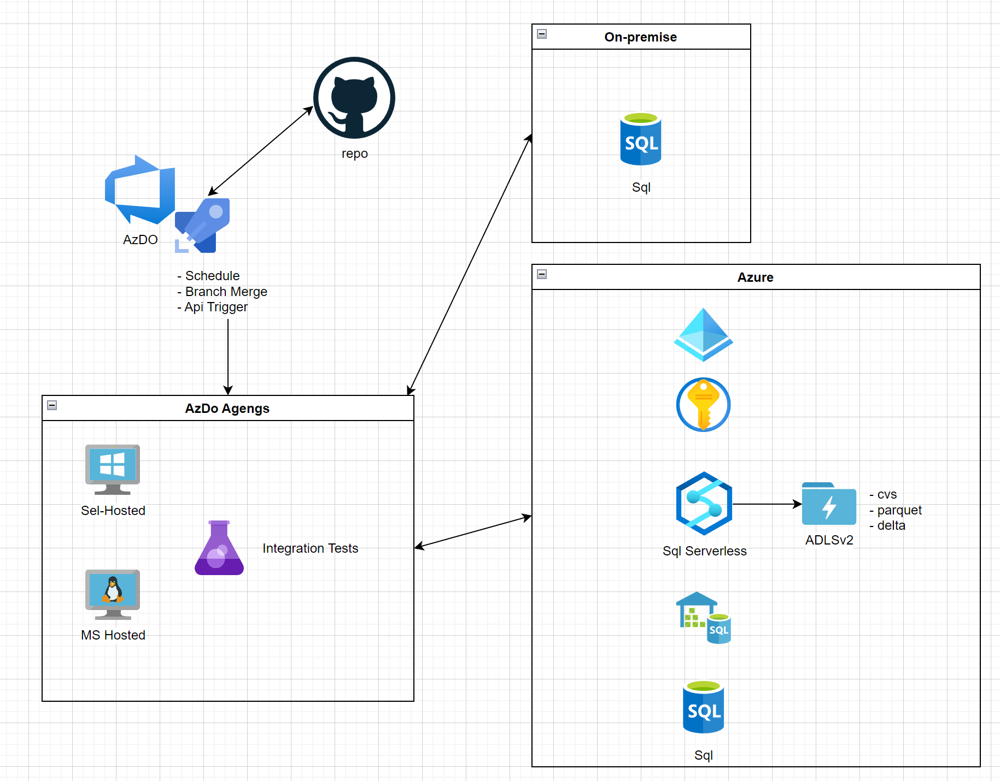

# Intro
The sample is meant to demonstrate integration test between 2 sql sources utilizing dontnet test and xUnit test framework.  The source db and target db are in Azure in the sample but can be easily modified to work on any sql datastore.  It also supports querying parquet and delta files via power of Azure Synapse Analytics Sql Serverless engine.  

## Project Prerequisites
- [Visual Studio](https://visualstudio.microsoft.com/): (Optional) You can use Visual Studio for developing and managing your .NET 6 test project.
- [Visual Studio Code](https://code.visualstudio.com/): (Optional) Visual Studio Code is a lightweight and highly customizable code editor suitable for .NET development.
- [Terraform](https://www.terraform.io/downloads.html): Terraform is used for managing infrastructure as code. Ensure that Terraform is installed if you plan to use infrastructure automation.
- [Azure cli](https://learn.microsoft.com/en-us/cli/azure/install-azure-cli) The Azure Command-Line Interface (CLI) is a cross-platform command-line tool to connect to Azure and execute administrative commands on Azure resources.

## High Level Design


## Azure Infrastructure

### Terraform (incomplete)
You can skip this portion if you have your Azure infrastructure setup already.  

use infra/terraform to create infra.
The sql db and synapse dw username and passwords will be saved to keyvault

set enviornment variables to desired sql auth values
```ps
$env:TF_VAR_sqlusername
$env:TF_VAR_sqlpassword
$env:TF_VAR_sqldwusername
$env:TF_VAR_sqldwpassword

run az login
az account set --subscription "subscriptionid"
terraform plan -out main.tf
terraform apply main.tf
```

### Microsoft Entra ID / Azure Active Directory
[App Registration](https://learn.microsoft.com/en-us/entra/identity-platform/app-objects-and-service-principals?tabs=browser) client Id and client secret is necessary to manage permission to different Azure resources as well as allowing self-hosted AzDo agent to run against Azure resources.

### Azure Key Vault
The key vault is used to sql / synapse dedicated pool / synapse sql serverless user name and password.  

You need to assign Key Vault Reader role to the service principle in the step above.

*Make sure to configure Network to allow running test from your network as well as self-host AzDo agent's network.*

### Azure Sql
In this particular example the test project authenticate against Azure Sql using sql authentication.  This can be modified to use service principle to make it more secure.

*Make sure to configure Network to allow running test from your network as well as self-host AzDo agent's network.*

### Azure Synapse Analtyics
In this particular example the test project authenticate against Azure Synapse using sql authentication.  This can be modified to use service principle to make it more secure.

Azure Synapse Analtyics supports Dedicated Pool / Serverless Sql Pool / Spark. This test project supports only the first 2 options.  

[Serverless Sql Pool](https://learn.microsoft.com/en-us/azure/synapse-analytics/sql/on-demand-workspace-overview)  allows users to query against csv/parquet/delta files in sql syntax with OPENROWSET

*Make sure to configure Network to allow running test from your network as well as self-host AzDo agent's network.*

### Azure Data Lake Storage v2
This is where the csv/parquet/dela files live.  You will need to grant Storage Blob Data Contributor role to Azure Synapse Analtyics (use MSI) for it to query the files in ADLSv2.

*Make sure to configure Network to allow running test from your network as well as self-host AzDo agent's network.*

## Test Project Application

### Configure the appsettings.json

```json
{
  "ConnectionStrings": {
    "Sql": "Server=tcp:<servername>.database.windows.net,1433;Initial Catalog=testsourcedb;Persist Security Info=False;User ID=##username##;Password=##password##;MultipleActiveResultSets=False;Encrypt=True;TrustServerCertificate=False;Connection Timeout=30;",
    "SynapseDedicatedPool": "Server=tcp:<servername>.sql.azuresynapse.net,1433;Initial Catalog=sqlpooltarget;Persist Security Info=False;User ID=##username##;Password=##password##;MultipleActiveResultSets=False;Encrypt=True;TrustServerCertificate=False;Connection Timeout=30;",
    "SynapseSqlServerless": "Server=tcp:<servername>-ondemand.sql.azuresynapse.net,1433;Initial Catalog=master;Persist Security Info=False;User ID=##username##;Password=##password##;MultipleActiveResultSets=False;Encrypt=True;TrustServerCertificate=False;Connection Timeout=30;"
  },
  "AzureResources": {
    "KeyVaultName": "<name of Azure Key Vault that's storing the secrets>",
    "TenantId": "<tenant id of the service principle and key vault>",
    "ServicePrincipleClientId": "<app registration client Id>",
    "ServicePrincipleClientSecret": "<app registration client secret>"
  }
}
``````

Make sure to keep ty ##username## and ##password## in place as the unit tests will grab the username/pwd from key vault and replace them in connection strings.

### Azure Key Vault Secrets
If you use the infra\terraform to create the Azure infrastructure, then the secrets are already set.  Otherwise, please go to Key Vault and add below secrets
```
secret-sql-username
secret-sql-password
secret-azuresynapse-username
secret-azuresynapse-password
```

## Azure DevOps

### Service Principle
[Service Princinple](https://learn.microsoft.com/en-us/azure/devops/integrate/get-started/authentication/service-principal-managed-identity?view=azure-devops) is used for the AzDO agent to connect to Azure Key Vault to retreive the key vault secrets when the test framework runs.  

### Library 
Create a variable group sqlunittest and add below variables:
```
AzureResources.TenantId: <Azure Tenant Id>
AzureResources.ServicePrincipleClientId: <client id>
AzureResources.ServicePrincipleClientSecret: <client secret>
```

### Pipeline
Create a new pipeline pointing to Github repo cicd/azDo/ci.yaml
file.

Configure your desired trigger and run the test!